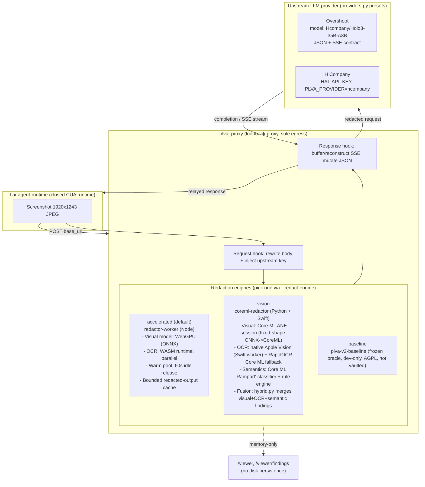

# PLVA architecture

## Model inventory

| Stage | Engine | Model / runtime |
|---|---|---|
| Visual PII detection (default) | `redactor-worker` | ONNX visual model on WebGPU |
| OCR (default) | `redactor-worker` | WASM OCR runtime, runs concurrently with visual |
| Visual PII detection (opt-in) | `coreml-redactor` | Fixed-shape ONNX→Core ML model on ANE (`visual_ane.py`) |
| OCR (opt-in) | `coreml-redactor` | Native Apple Vision (Swift, `vision_ocr_worker.swift`) + RapidOCR Core ML fallback |
| Semantic classification (opt-in engine only) | `coreml-redactor` | Rule engine + Core ML "Rampart" classifier (`semantics.py`) |
| Redaction oracle (dev-only) | `plva-v2-baseline` | Frozen v2 detector, gitignored, AGPL |
| Upstream completion | `plva_proxy/providers.py` | Overshoot: `Hcompany/Holo3-35B-A3B`; or H Company endpoint |

Not built yet: placeholder-ID substitution, vault, resolution, history scrubbing.
